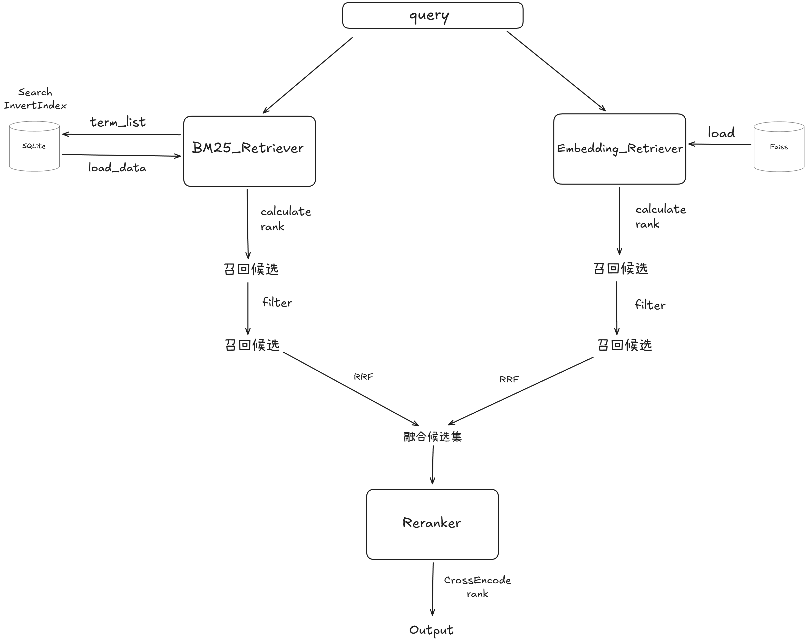
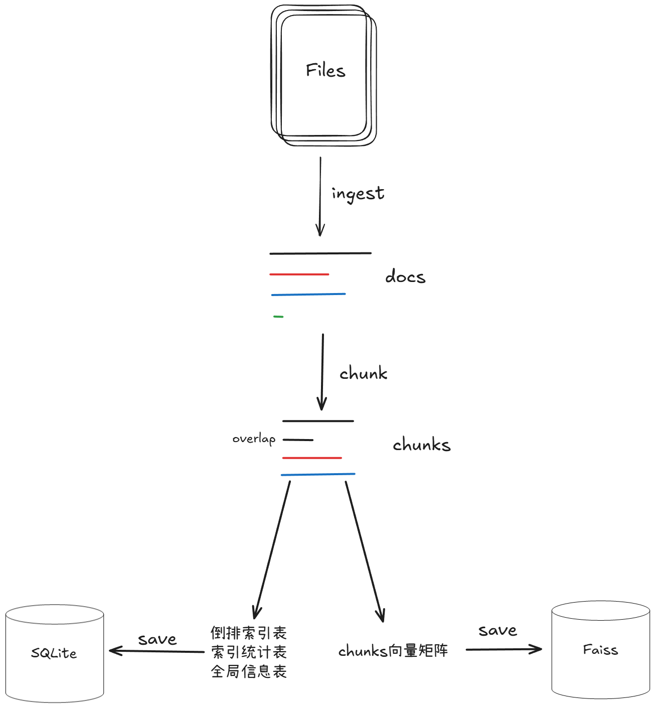
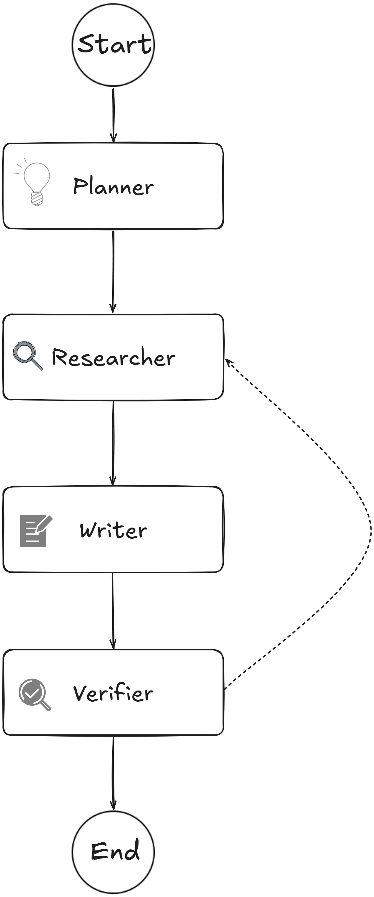
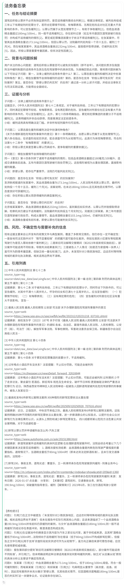

# Tiny-Agent

## 1.简介

Tiny-Agent 是一个面向中文法务场景的本地优先 RAG 小系统，集成 rag 检索、Web 交互与可编排的 deep_research 工具。系统支持 law/case 数据库构建与证据池展示，帮助在对话中给出可追溯的依据与结论，并便于后续扩展多 Agent 编排。

## Demo

<video src="https://github.com/user-attachments/assets/1260d2f2-f31e-4fae-8860-5958995ccd8a" width="720" height="480" controls muted style="display: block; margin: 0 auto 50px auto;"></video>

[快速运行](#5运行)

## 2.主Agent介绍

### 2.1 意图路由

本项目将“普通对话”和“深度报告”分成两条相对独立的路径，核心目的是让系统的行为可预测且不失控。普通对话由主 Agent 直接完成，主 Agent 会在需要时调用 RAG 与 web 工具补证；当用户明确提出“详细报告、研究报告、调研、完整分析”等需求时，系统会进行意图判定并切换到 deep_research 工具，以多阶段流程生成结构化报告。该路由逻辑位于 `agent/routing.py`，当前采用关键词匹配的方式实现，入口侧在 `script/agent_turn.py` 中调用 `should_use_deep_research` 进行分流，从而在交互体验上做到“轻问轻答、重问重答”。


### 2.2 长期记忆

长期记忆用于在多轮会话中保留用户目标、约束条件与关键事实，避免每次对话都从零开始。项目在 `agent/memory/store.py` 中实现了 `MemoryStore`，它会按 `thread_id` 将消息与摘要写入本地 SQLite，默认路径为 `data/agent_memory/memory.sqlite`，并启用 WAL 模式以降低并发读写的阻塞。摘要更新在每轮对话结束后触发，系统会根据“旧摘要、旧事实 JSON、本轮用户输入与本轮助手输出”生成新的 `summary` 与 `facts`，并在后续对话时以系统消息的形式注入给主 Agent，Web 侧也会将该摘要展示在左侧栏中，便于用户快速回忆上下文与历史结论。


## 3.工具介绍

### 3.1 Rag  

RAG 检索能力由 `tinyrag/langchain_tools.py` 中的 `rag_search` 工具提供，它面向中文文档的证据检索场景，默认支持 `law`（法律法规）与 `case`（司法案例）两类数据库。该工具在召回阶段结合 BM25 与向量检索获取候选片段，并通过 RRF 融合与 `bge-reranker-base` 重排模型进一步排序，从而在不牺牲可解释性的前提下提升检索相关性。为了避免在 Web 与多轮对话中反复加载索引造成冷启动延迟，检索器会按线程缓存并在服务启动阶段进行预热，后续检索会更稳定、更快速。

检索流程大致如下：



RAG 的输出采用可直接引用的 Observation 文本格式，每条证据以 `[n]` 编号呈现正文片段，并在下一行以 `source=...` 给出来源定位信息。对于 `law` 数据，`source` 通常包含文件路径与“编章节条”等结构化定位字段；对于 `case` 数据，`source` 通常包含 PDF 路径、页码与章节信息，便于在报告中做到“结论—证据”可追溯。

数据库需要先建库再检索，建库入口位于 `script/rag_cli.py`，示例如下。

```bash
python -m script.rag_cli build --db-name law  --path data\\raw_data\\law
python -m script.rag_cli build --db-name case --path data\\raw_data\\case
```

建库流程大致如下：



详细请查阅另一个仓库[tiny-rag-advanced](https://github.com/soberm258/tiny-rag-advanced)

### 3.2 web检索

web 检索用于补齐本地库之外的在线信息来源，尤其适用于政策解读、地区性口径、最新发布的通知公告等“时效性强且不一定已入库”的内容。`agent/tools/web_search.py` 基于 **MCP + SerpAPI** 获取搜索结果，输出为 JSON 字符串，其中包含 `query` 与 `results` 列表，列表项通常携带 `title`、`url`、`snippet` 与 `provider` 字段，用于快速定位候选网页。为了保证主流程可用性，当未配置 `SERPAPI_API_KEY` 时工具会返回带 `error` 的空结果，而不会让整个对话流中断。

由于搜索引擎返回的 `snippet` 往往较短且包含噪声，系统在需要形成可引用证据时会进一步调用 `agent/tools/web_fetch.py` 抓取网页并抽取正文。该抓取工具采用 **trafilatura** 提取主内容，默认过滤评论与表格，能显著减少导航栏、广告与无关内容对下游写作的干扰，并以 `url/title/excerpt/source` 等字段形成可复用的证据条目。

### 3.3 deep_research

deep_research 面向“需要详细报告”的任务，其实现位于 `agent/tools/deep_research.py`，并使用 LangGraph 将流程明确拆分为 Planner、Research、Writer、Verifier 四个阶段。Planner 负责把任务拆解为可验证的子问题与检索计划，Research 负责组合调用 `rag_search`、`web_search` 与 `web_fetch` 构建证据池，Writer 依据固定模板生成报告正文并对引用编号进行连续化重排，Verifier 对“结论与证据对齐、引用编号合法、信息缺口可解释”等质量点进行检查。为了保证系统可预测且不失控，无论质检是否通过，流程都会在 Verifier 后结束并输出报告草稿，同时附带“质检提示”，便于用户快速定位仍需补证或改写的部分。

deep_research 支持独立的模型配置，当存在 `DEEP_RESEARCH_MODEL_ID` 时会优先使用该模型执行规划、写作与质检；若未配置则回落到主对话模型 `LLM_MODEL_ID`。该设计使主 Agent 可以保持较高响应速度，而在需要完整论证与严谨引用时再使用更强的研究写作模型完成深度输出。

deep_research流程大致如下：



效果如下：



## 4.项目文件简介

```shell

├─agent                   # Agent 相关代码（主对话、路由、工具、记忆）
│  ├─agent.py             # 主 Agent 入口（对话 + 工具调用）
│  ├─routing.py           # 意图路由（是否触发 deep_research）
│  ├─memory               # 长期记忆（SQLite 存储与摘要更新）
│  ├─prompts              # 主 Agent / deep_research 的提示词
│  └─tools                # 工具实现（web_search/web_fetch/deep_research 等）
├─web                     # Web UI（Gradio）
│  ├─app.py               # Web 服务入口
│  └─assets               # 前端样式等静态资源
├─script                  # 脚本入口（CLI 与对话流）
│  ├─rag_cli.py           # RAG 建库/检索 CLI
│  └─agent_turn.py        # 单轮对话流（含证据池事件）
├─data                    # 本地数据库数据目录
├─doc                     # 文档与截图
├─eval                    # 检索评测
├─models                  # 本地模型目录
├─test                    # 测试
└─tinyrag                 # RAG 核心实现
```


## 5.运行

本项目的主要入口脚本位于 `web\app.py` 目录，以及CLI位于`agent\agent.py`供快速使用。

### 5.1 依赖与环境

项目依赖列表位于 `requirements.txt`，其中包含文本处理、检索与模型推理所需的常用库。若你计划使用 GPU，请根据本机 CUDA 版本单独安装合适的 torch 版本。若需要 FAISS，Windows 环境通常建议使用 conda 安装 `faiss-cpu` 或 `faiss-gpu`，以减少编译与兼容问题。

```bash
pip install -r requirements.txt
```

`.env`文件填入可选的选项
- TINYRAG_EMB_BATCH_SIZE
- TINYRAG_BM25_BACKEND
- TINYRAG_DEVICE
- LLM_API_KEY
- LLM_MODEL_ID
- DEEP_RESEARCH_MODEL_ID
- LLM_BASE_URL
- SERPAPI_API_KEY

### 5.2 模型准备

必须：
- [bge-reranker-base](https://huggingface.co/BAAI/bge-reranker-base)
- [bge-base-zh-v1.5](https://huggingface.co/BAAI/bge-base-zh-v1.5)(embedding嵌入)
- [Qwen2-1.5B-Instruct](https://huggingface.co/Qwen/Qwen2-1.5B-Instruct)(hyde生成)

可选：

- [clip-ViT-B-32](https://huggingface.co/sentence-transformers/clip-ViT-B-32)
- [nlp_bert_document-segmentation_chinese-base](https://www.modelscope.cn/models/iic/nlp_bert_document-segmentation_chinese-base)


### 5.3 运行

进入项目
```bash
cd tiny-agents
```

web服务
```bash
python -m web.app
```

访问[127.0.0.1:7860](http://127.0.0.1:7860)

CLI多轮问答
```bash
python -m agent.agent
```

### 5.4 运行结果

```bash
python -m agent.agent
```

```text
用户: 什么是合同法中的不可抗力？
助手: 根据《中华人民共和国民法典》的相关规定，合同法中的不可抗力具有以下法律内涵：

1. **定义**  
不可抗力是"不能预见、不能避免且不能克服的客观情况"（第180条），属于法定免责事由。其核心特征表现为三个"不能"：预见性、避免性与克服性的客观不可能。

2. **法律后果**  
（1）**免责效力**：当事人因不可抗力不能履行合同的，可部分或全部免除责任（第590条），但法律另有规定除外；  
（2）**合同解除权**：若不可抗力导致合同目的无法实现，当事人有权解除合同（第563条）；  
（3）**特殊场景适用**：如运输合同中，货物因不可抗力灭失的，未收取运费不得请求支付，已收取运费应返还（第835条）。

3. **当事人义务**  
发生不可抗力时，受影响方需履行两项义务：  
- 及时通知对方以减轻损失；  
- 在合理期限内提供不可抗力证明（第590条）。

注：若不可抗力发生在迟延履行后，则不免除违约责任（第590条）。具体适用需结合案件事实与证据判断。

用户: exit 
退出对话。
```
